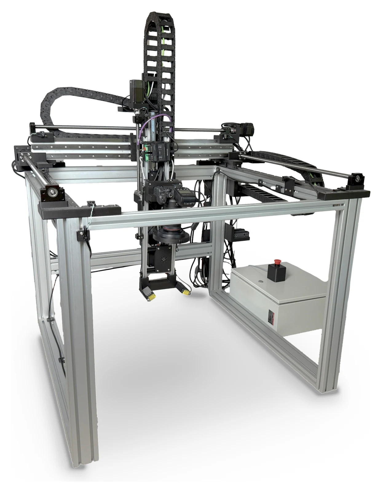

# OpenDerm

[OpenDerm](https://openderm.github.io/) is an open-source robotic imaging system for creating high-resolution, reproducible 3D maps of the skin that can be compared over time to detect early signs of skin cancer.



## System architecture

The system uses three computers:

| Computer                                 | Connected hardware                              | OpenDerm role                                                   |
| ---------------------------------------- | ---------------------------------------------- | --------------------------------------------------------------- |
| Raspberry Pi #1 (`openderm-gantry.local`) | Octopus Pro/Klipper and the Y/Z Pico           | X-axis gantry API and Pico TCP bridge                           |
| Raspberry Pi #2                           | CAN-controlled RX-axis motor, Canon EOS R7, ADS1115, sensor GPIO | Homing, standoff regulation, and scan capture                   |
| Workstation                              |                                       | 3D reconstruction, longitudinal comparison |

Raspberry Pi #1 controls the X-axis via Klipper. The Raspberry Pi Pico controls the Y and Z axes; Raspberry Pi #2 controls the RX joint, the camera, and the distance sensors.

## Documentation

### Build and configure

- [Project website](https://openderm.github.io/) — project overview, hardware design, CAD, bill of materials, wiring, and assembly instructions.
- [Raspberry Pi and Octopus Pro setup](docs/fresh-start-pi-octopus-pro.md) — configure Raspberry Pi #1, Klipper, Moonraker, and the X-axis controller.

### Operate and capture

- [Motion control](docs/motion.md) — start the motion services and control the X, Y, Z, and RX axes.
- [Distance sensors and RX limit switches](docs/sensors.md) — sensor wiring, readings, and limit-switch commands.
- [Camera capture](docs/camera.md) — configure Canon EDSDK and capture photographs.
- [Capture and processing procedure](docs/scanning-procedure.md) — preflight, calibration, scanning, reconstruction, and scan comparison.

### Process and compare

- [Skin reconstruction and registration](docs/skin-registration.md) — reconstruction method, longitudinal comparison, uncertainty, and limitations.

### Technical references

- [Self-collision guard](docs/collision_guard.md) — collision-envelope generation, runtime enforcement, and safety behavior.
- [Calibration and collision scripts](docs/calibration-and-collision.md) — RX-pivot calibration, floor calibration, and collision-envelope tools.

## Install

OpenDerm requires Python 3.11 or newer. Clone OpenDerm on both Raspberry Pis and install it into a virtual environment:

```bash
python3.11 -m venv .venv
source .venv/bin/activate
python -m pip install --upgrade pip
python -m pip install -e ".[hardware]"
```

Copy [config/openderm.env.example](config/openderm.env.example) to an untracked local file on both Pis and edit the hostnames or IP addresses. Generate one shared control token, put the same value in both files, and never commit it:

```bash
python -c 'import secrets; print(secrets.token_urlsafe(32))'
```

Load the environment in each shell:

```bash
set -a
source /path/to/openderm.env
set +a
```

If `openderm-gantry.local` does not resolve on Raspberry Pi #2 or an operator workstation, use Raspberry Pi #1's reserved LAN address instead (e.g. 192.168.1.188).

## Start

On Raspberry Pi #1, start the X-axis service and Pico bridge in separate terminals:

```bash
openderm-gantry-server --host 0.0.0.0 --port 8090
openderm-pico-bridge --host 0.0.0.0 --port 8095
```

Non-loopback motion services refuse to start without `OPENDERM_CONTROL_TOKEN`. HTTP clients and the Pico socket client read the token from the environment automatically. Keep ports 8090 and 8095 on a private, firewalled control network; the token does not replace network segmentation or a physical emergency stop.

On Raspberry Pi #2, start the RX-axis service:

```bash
openderm-rx-axis-server --axis rx --host 127.0.0.1 --port 8091
```

## Home and move the robot

Use the `home` and `move-to` commands for every axis:

```bash
openderm --axis x home
openderm --axis x move-to 250 --feed 900

openderm --axis y home
openderm --axis y move-to 175
openderm --axis z home
openderm --axis z move-to 200

openderm --axis rx home
openderm --axis rx move-to 0.95 --speed 0.2
```

The configured linear travel limits are X: 0–800 mm, Y: 0–665 mm, and Z: 0–392 mm. Verify direction, limit switches, and stopping behavior one axis at a time before running a coordinated workflow.

## Regulate standoff

On Raspberry Pi #2, regulate the camera head to the configured 110 mm working distance above the subject:

```bash
openderm-regulate --debug
```

`PICO_PORT` defaults to a TCP bridge derived from `GANTRY_SERVER_URL`. For example, setting `GANTRY_SERVER_URL=http://192.168.1.188:8090` automatically selects `socket://192.168.1.188:8095` unless `PICO_PORT` is set explicitly. Run `openderm-regulate --help` to inspect or adjust the regulation parameters.

## Capture scans

`openderm-scan` follows the subject contour:

```bash
openderm-scan captures/subject-001-site-001 --debug
```

Inspect the resolved capture parameters without moving hardware:

```bash
openderm-scan captures/subject-001-site-001 --show-config
```

Run `openderm-scan captures/subject-001-site-001 --advanced-help` to list the tuning options. Follow the preflight, subject-positioning, focus, overlap, and edge-recovery procedure in [docs/scanning-procedure.md](docs/scanning-procedure.md) before a human scan.

## Reconstruct and compare scans

Install the vision dependencies on a workstation:

```bash
python3.11 -m venv .venv
source .venv/bin/activate
python -m pip install -e ".[vision]"
```

Calibrate the intrinsics of your camera independently with the exact lens, manual-focus setting, and full-resolution image dimensions used for capture. OpenDerm does not provide a camera-calibration utility. The reference camera's full-resolution focal length, `39237 px`, is the default; supply your calibrated focal length with `--fx-full` when it differs:

```bash
openderm-process captures/subject-001-site-001 --fx-full <focal-length-px>
```

`openderm-process` fits the rig model for the current scan, builds the canonical reconstruction, and runs both artifact checks:

```bash
openderm-process captures/subject-001-site-001
```

Use `--quality full` for the sharpest 78 px/mm texture after the preview passes artifact checks.

Compare two canonical scans of the same anatomical site:

```bash
openderm-compare subject-001-site-001 subject-001-site-002 --captures captures
```

Processing outputs include `texture.jpg`, `surface_mesh.obj`, `viewer.html`, `placements3d.json`, `report.txt`, artifact-check crops, and a longitudinal change report. See [docs/skin-registration.md](docs/skin-registration.md) for the reconstruction and uncertainty model.

## Repository layout

- `src/capture/` — hardware control and capture workflows.
- `src/processing/` — 3D registration, artifact detection, and scan comparison.
- `src/pico/` — MicroPython Y/Z motion firmware.
- `src/tests/` — hardware-free unit and simulation tests.
- `src/scripts/calibration/` — RX-pivot and floor calibration tools.
- `src/scripts/collision/` — CAD-derived collision-envelope tools.
- `config/` — environment templates, Klipper configuration, CAD models, calibration, and collision tables.
- `third_party/` — vendored Three.js libraries and the Pico compatibility launcher.
- `docs/` — setup, operation, reconstruction, and safety documentation.

Non-code test fixtures belong in `test-assets/` when needed; generated example
outputs are not tracked. Documentation, licenses, and files required at fixed
locations by build tools or GitHub remain outside these directories.

## Verify the installation

```bash
python -m pip install -e ".[hardware,vision]"
python -m pip install pytest
python -m pytest
```

## Safety
> **Caution:** OpenDerm is research software, not a medical device, and does not diagnose melanoma or any other condition. Operating the robot can cause impact, pinch, electrical, and laser hazards; validate limits and emergency stops without a person in the workspace before human imaging.

## License

OpenDerm is available under the [MIT License](LICENSE).
